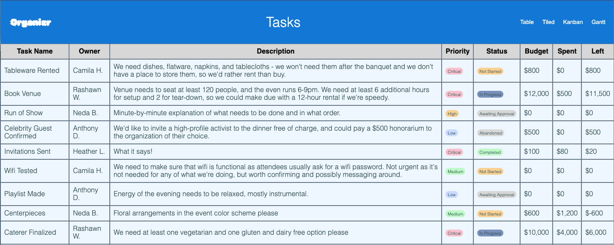
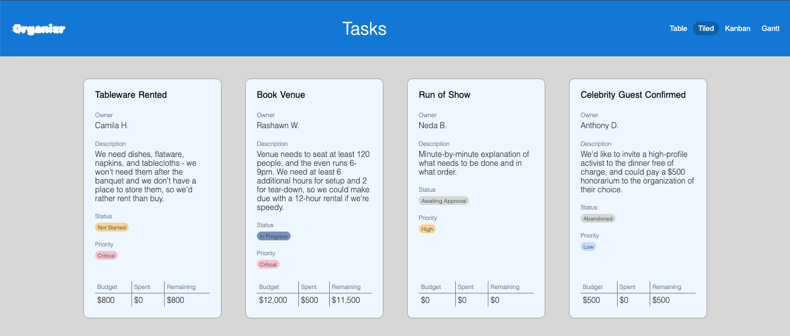
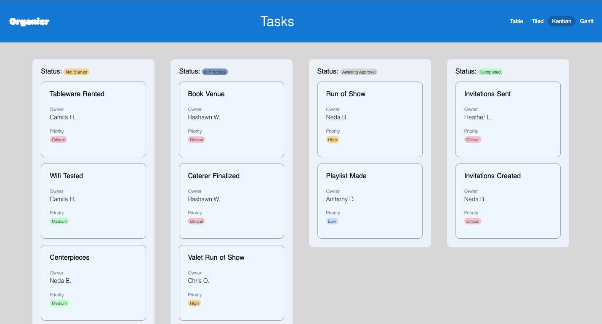

# Grid & Flexbox

## [THEME]

## Objectives

- Use flexbox to create horizontal and vertical layouts.
- Use grid to create 2D layouts.
- Use grid to create rigid horizontal and vertical layouts.
- Nest flexbox containers to create 2D layouts.
- Use the styled components library to limit the cascade.
- Correctly identify situations where flexbox and grid are not the ideal layout solutions.

## Why?

Layout is complicated, and the more creative your layouts get, the more thoughtful you have to be about

## Setup

This is a standard react project - run `npm run start` or our standard `npm run play` to start the lab.

## Framing

We're building a task-layout board called **Organizr**, and we're going to do it all: Kanban Boards, Tables, Tiles, and maybe even a Gantt chart if there's time.

We're just building the layout for the front-end, so some sample data is already loaded in - other members of our team will build the back-end (and any necessary transformation layers) to connect to real user data later.

## Exercises

### 1. Make the navigational menu bar

All the pieces of the NavMenu have been built, but right now there aren't any rules for how to lay out the menu bar.

The finished product should look something like this:

You're welcome to use any layout tools you like, but the example shown above can be accomplished exclusively by adding flex (and related properties), margin, and padding to the existing classes. You can fine-tune the visuals with some borders, outlines, border-radii.

### 2. Make the TableView

The table is supposed to look like this:

The first attempt to style it used Grid, which was really difficult because it didn't play nicely with the `.map` property used to spell out the cells - React requires that a map's callback return a single jsx element, but wrapping an entire return in a row makes it hard to render with CSS Grid, which assumes that all members of the grid are direct children of the parent element.

The second attempt to style it uses Flexbox, which is where the code is currently. The idea of having each row be a flex parent is a sound one, but since each row operates independently of the others, there's not a way to ensure that the element sizing in one row corresponds to the element sizing of the next. It's definitely not working.

The dev team right now is debating two possible solutions:

1. Render the entire table as an HTML `table` element, with corresponding `tr`, `td`, and `th` elements to make up the body of that table. Then adjust the styles to match the styling in the above preview.
2. Render each row in the table as an instance of a grid styled component, and ensure that the template of that styled component's columns are rigid enough so that each row of the table is rendered with identical dimensions.

You can decide which of these routes to pursue. Either way, you'll need to refactor the `className` method of styling in favor of styled components, and you'll likely want to change some elements from generic `div`s to other more specific elements.

### 3. Make the TileView grid of cards.

The tile view should look like this:

It's important to note that this display won't always be four cards across. The number of columns should grow and shrink according to the user's display. The next task will be about sizing or resizing the individual cards, so try to envision the adjustments necessary with these half-finished placeholder cards for now.

### 4. Make the individual Cards

Refer to the above preview to see the desired output for individual cards.

The individual cards need a fair bit of work. Here's how you might want to break it down:

1. Fiddle with the border, padding, and margins to get the cards shaped a bit more like the preview. Pay attention to small details like the margin-bottom of the tiny headers to get a satisfying result.
2. Display the remainder of the non-numerical information on the cards.
3. Add the budget grid to the bottom of each card. As before this is accomplishable with both a table and a grid, but is probably easiest with a CSS Grid layout.

### 5. Update the Status and Priority Badges

The Status and Priority badges are meant to render conditionally with specific colors everywhere they're used. Fixing this throughout your program will require a few steps:

1. Update your code so that every time a status or priority is displayed, it does so using the corresponding component from the `Badges` folder.
2. Update the badge components so that they pass their props on to the styled component.
3. Reconfigure the background color of the styled component so that it renders conditionally based on the status or priority of the given component. The recommended colors are included as comments in `Badges.styles.ts`.

### 6. Make the Kanban board

Here's the ideal Kanban Board:

This view doesn't need drag-and-drop functionality just yet, but it does need to render correctly. Here are some recommended ways to break that down.

1. Put a column on the page for each of the statuses that will render to the page.
2. Come up with a way to sort or filter the list of Tasks such that each column only renders out the corresponding cards. This will likely reveal some errors in your initial assumptions about how to set up your columns.
3. Adjust the columns so that they match the mockup above.
4. We need an abbreviated version of the cards - we'll add an additional boolean prop like `abbreviated` or `full` to help signal which version of the card we want. Modify the Card component to render these more abbreviated versions of the cards for the kanban view, but displays full cards for the tiled view.

### 7. Make the Gantt chart, or add other Extension Features.

At this point, you're welcome to add in any of the following features. They're all on the roadmap, so any of them will be useful. They do not need to be attempted in any specific order.

1. The [Gantt](https://en.wikipedia.org/wiki/Gantt_chart) chart hasn't been mocked up yet, but you're welcome to give it a try. There's a date field there, but it hasn't been parsed into a Date object yet, so that's a good place to start.
2. The TableView should sort the data when you click on a column header. Add that feature.
3. The TileView should have some GUI elements to allow you to filter out some of the cards. For example, there could be buttons or checkboxes that let you hide less urgent tasks, or a live search text field that filters out non-matching cards.
4. The columns in the TableView should be resizeable.
5. We should be able to scroll to the right and left in the TableView, especially on smaller displays.
